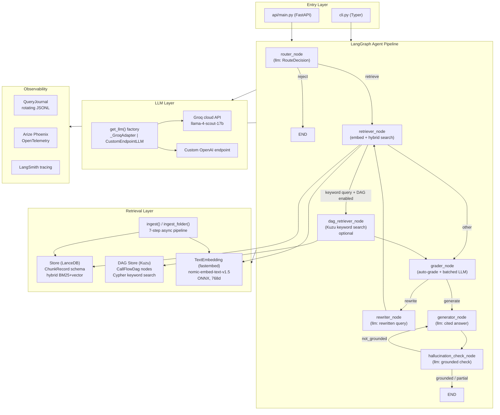

# SpecAgent — Developer Guide

## Architecture Overview

SpecAgent is a Python application built on LangGraph for agentic orchestration, LanceDB for hybrid vector search, Kuzu for embedded graph-based call-flow DAG retrieval, and FastAPI for the REST API. The system comprises four main layers:

1. **Entry layer** — CLI (`cli.py` via Typer) and REST API (`api/main.py` via FastAPI)
2. **Agent pipeline** — a compiled LangGraph `StateGraph` with seven nodes that share a `GraphState` TypedDict
3. **Retrieval layer** — LanceDB store with hybrid BM25+vector search, fastembed embedder, a 7-step async ingestion pipeline, and optional call-flow DAG augmentation via Kuzu (when `ENABLE_DAG_RETRIEVAL=true`)
4. **Support layer** — LLM factory (Groq/custom endpoint), observability journal, Arize Phoenix + LangSmith tracing, and RAGAS evaluation



## Project Structure

```
specagent/
├── src/specagent/
│   ├── __init__.py              # Package root; exports __version__
│   ├── config.py                # Settings (Pydantic BaseSettings, lru_cache singleton)
│   ├── cli.py                   # Typer CLI: serve, query, index, benchmark, download-model, version
│   ├── api/
│   │   ├── main.py              # FastAPI app factory, /health + /query endpoints, lifespan hooks
│   │   └── models.py            # QueryRequest, QueryResponse, CitationSchema, HealthResponse
│   ├── graph/
│   │   ├── state.py             # GraphState TypedDict; RetrievedChunk, GradedChunk, Citation dataclasses
│   │   └── workflow.py          # build_graph(), run_query(), conditional edge functions
│   ├── nodes/
│   │   ├── router.py            # router_node: LLM → RouteDecision (retrieve | reject)
│   │   ├── retriever.py         # retriever_node: embed + hybrid search → list[RetrievedChunk]
│   │   ├── dag_retriever.py     # dag_retriever_node: Kuzu keyword search → dag_chunks; route_after_retriever edge
│   │   ├── grader.py            # grader_node: auto-grade + batched LLM → list[GradedChunk]
│   │   ├── rewriter.py          # rewriter_node: LLM query reformulation
│   │   ├── generator.py         # generator_node: LLM answer synthesis + citation extraction
│   │   └── hallucination.py     # hallucination_check_node: LLM-as-judge grounding check
│   ├── memgraph/                # Kuzu embedded graph store for call-flow DAGs
│   │   ├── connection.py        # KuzuConnection: execute_cypher / execute_cypher_write / health_check
│   │   ├── dag_store.py         # CallFlowDagStore: store_call_flow_dag, query_dags_by_keyword, get_dag_mermaid
│   │   ├── mermaid_parser.py    # parse_sequence_diagram(): Mermaid → StepRecord list
│   │   ├── resources.py         # get_dag_store() / get_dag_connection() lru_cache singletons
│   │   └── cypher/
│   │       └── call_flow_dag_schema.cypher  # Kuzu DDL reference (auto-applied by KuzuConnection)
│   ├── retrieval/
│   │   ├── store.py             # Store class (LanceDB CRUD), ChunkRecord schema, _lance_schema()
│   │   ├── ingestor.py          # ingest() / ingest_folder(): 7-step async pipeline
│   │   ├── chunker.py           # chunk() / chunk_with_metadata(): token-aware recursive splitter
│   │   ├── embedder.py          # embed_documents() / embed_query() with nomic prefix handling
│   │   ├── converter.py         # convert() via MarkItDown; convert_docx_ocr() two-pass OCR
│   │   ├── markdown_postprocessor.py  # Strip TOC, change history, fix annex headings
│   │   ├── resources.py         # get_store() / get_embedder() lru_cache singletons
│   │   └── exceptions.py        # UnsupportedFormatError, IngestionError, StoreError, EmbeddingError
│   ├── llm/
│   │   ├── factory.py           # create_llm() / get_llm(): dispatches to _GroqAdapter or CustomEndpointLLM
│   │   └── custom_endpoint.py   # CustomEndpointLLM: OpenAI-compatible endpoint with retry + @traceable
│   ├── observability/
│   │   ├── models.py            # LLMCallRecord, RetrievalRecord, QueryEvent Pydantic models
│   │   ├── journal.py           # QueryJournal: thread-safe rotating JSONL writer
│   │   └── report.py            # build_query_report() / log_report(): per-query metrics summary
│   ├── tracing/
│   │   ├── phoenix.py           # setup_tracing(), create_phoenix_node_wrapper()
│   │   ├── langsmith.py         # setup_langsmith_tracing()
│   │   └── rag_spans.py         # emit_retrieval_span(), emit_llm_usage_span(), emit_query_span()
│   └── evaluation/
│       ├── benchmark.py         # TSpec-LLM runner: BenchmarkQuestion, BenchmarkReport, run_benchmark()
│       └── metrics.py           # RAGAS metrics wrappers
├── tests/
│   ├── conftest.py              # Shared fixtures: mock_llm, mock_store, tmp LanceDB, sample chunks
│   ├── unit/                    # Pure function tests (no I/O)
│   ├── integration/             # Real LanceDB in tmp_path; no LLM calls
│   └── e2e/                     # Full pipeline with mocked LLM and store
├── docs/                        # Documentation
├── scripts/
│   └── download_data.py         # Download TSpec-LLM dataset from HuggingFace Hub
├── k8s/                         # Kubernetes manifests
├── pyproject.toml               # Dependencies, build config, ruff/pytest config
├── Dockerfile                   # Production container image
└── docker-compose.yml           # Local dev stack: API + Phoenix (+ optional Gradio UI)
```

## Key Modules and Responsibilities

### `config.py` — Settings singleton

`Settings` inherits from `pydantic_settings.BaseSettings`. All fields map to environment variables (case-insensitive). Loaded once via `@lru_cache` and exposed as the module-level alias `settings`. Covers model IDs, LanceDB paths, chunking parameters, grading thresholds, API host/port, observability flags, and vision/OCR settings.

Relevant thresholds used by the agent logic:

| Setting | Default | Purpose |
|---|---|---|
| `grader_confidence_threshold` | 0.60 | Below this → trigger rewrite |
| `min_relevant_chunk_percentage` | 0.50 | Below this → trigger rewrite |
| `high_similarity_threshold` | 0.85 | Top-3 avg above this → skip rewrite (fast heuristic) |
| `max_rewrites` | 1 | Per-pipeline rewrite cap (overridable per request) |
| `retrieval_top_k` | 10 | Chunks fetched per retrieval call |

### `graph/state.py` — Shared pipeline state

`GraphState` is a `TypedDict(total=False)` — all fields are optional to allow incremental population. Dataclasses `RetrievedChunk`, `GradedChunk`, and `Citation` hold the structured objects that flow between nodes.

```
GraphState fields (grouped by pipeline stage):
  Input:          question
  Routing:        route_decision, route_reasoning
  Retrieval:      retrieved_chunks, rewritten_question
  DAG retrieval:  dag_chunks  (RetrievedChunk objects from Kuzu; empty list when DAG disabled)
  Grading:        graded_chunks, average_confidence
  Rewriting:      rewrite_count
  Generation:     generation, citations
  Hallucination:  hallucination_check, ungrounded_claims, regeneration_count
  Overrides:      max_rewrites_override, library_filter
  Metadata:       error, processing_time_ms, node_timings, trace_id
  Observability:  llm_calls, retrieval_events, grader_auto_count, grader_llm_count
```

### `graph/workflow.py` — Pipeline orchestration

`build_graph()` constructs a `StateGraph(GraphState)`, wraps each node with `create_timed_node()` (timing) and `create_traced_node()` (Phoenix OTel span), and wires the conditional edges:

- `should_retrieve`: `router → retrieve | reject`
- `should_rewrite`: `grader → rewrite | generate` (uses high-similarity fast heuristic first, then grader confidence and relevant-chunk-percentage checks)
- `should_regenerate`: `hallucination_check → regenerate | finish` (allows exactly one regeneration on `not_grounded`; `partial` is surfaced but not retried)

`run_query()` is the public entry point. It creates initial state, invokes the compiled graph (cached as a process-level singleton via `_get_compiled_graph()`), records total elapsed time, and flushes the `QueryJournal` and monitoring report.

### `nodes/` — Agent nodes

Every node has the signature `def node_name(state: GraphState) -> GraphState` and must not raise exceptions — errors are written to `state["error"]` and the node returns gracefully.

| Node | LLM calls | Key output fields |
|---|---|---|
| `router_node` | 1 (structured: `RouteDecision`) | `route_decision`, `route_reasoning` |
| `retriever_node` | 0 (embed + search) | `retrieved_chunks`, `retrieval_events` |
| `dag_retriever_node` | 0 (Kuzu keyword search; optional) | `dag_chunks` |
| `grader_node` | 0–1 (batched `BatchGradeResult` for mid-range chunks) | `graded_chunks`, `average_confidence` |
| `rewriter_node` | 1 (free text) | `rewritten_question`, `rewrite_count` |
| `generator_node` | 1 (free text with citation extraction) | `generation`, `citations` |
| `hallucination_check_node` | 0–1 (skipped when avg confidence above threshold; `HallucinationResult`) | `hallucination_check`, `ungrounded_claims`, `regeneration_count` |

**Grader auto-grading thresholds** (in `nodes/grader.py`):
- `similarity_score > 0.82` → auto "yes" (no LLM call)
- `similarity_score < 0.55` → auto "no" (no LLM call)
- `0.55 ≤ similarity_score ≤ 0.82` → single batched LLM call for all mid-range chunks

**Hallucination skip thresholds** (in `nodes/hallucination.py`):
- `average_confidence ≥ 0.65` (numerical/tabular content) → skip check
- `average_confidence ≥ 0.70` (other content) → skip check

### `memgraph/` — Kuzu embedded graph store

The `memgraph/` package implements the optional call-flow DAG layer. Despite the package name (inherited from the original Memgraph design), it now uses **Kuzu** — an in-process embeddable graph database — with no external server or port.

`KuzuConnection` opens (or creates) a Kuzu database at `kuzu_db_path` and auto-applies the DDL schema on first access. It exposes the same `execute_cypher` / `execute_cypher_write` / `health_check` interface used by `CallFlowDagStore`, keeping the store layer independent of the backend.

`CallFlowDagStore` writes call-flow diagrams extracted from `.docx` files as a graph: `CallFlowDag → HAS_STEP → DagStep` and `CallFlowDag → HAS_PARTICIPANT → DagParticipant`. Retrieval uses Kuzu's `any(kw IN $keywords WHERE ...)` predicate for case-insensitive keyword matching across step messages, titles, and prose descriptions.

`dag_retriever_node` is the conditional LangGraph node that queries the DAG store. It is only reached when:
1. `ENABLE_DAG_RETRIEVAL=true`, and
2. `route_after_retriever()` detects call-flow keywords (procedure, sequence, call flow, 3GPP participants like UE/AMF/gNB) in the query.

Results are injected into `state["dag_chunks"]` as `RetrievedChunk` objects with `section="Call Flow Diagram"` and a configurable `similarity_score` (`DAG_RETRIEVAL_SCORE`). They travel through the grader and generator as a separate lane from vector-retrieved chunks.

### `retrieval/store.py` — LanceDB access

`Store` wraps `lancedb.Table` with lazy connection (opens on first access, cached in `_cached_table`). `ChunkRecord` is the Pydantic model that maps to the Arrow schema. The `search()` method performs `query_type="hybrid"` (BM25 + ANN vector), applies `WHERE` clause filtering by library and optional field equality filters, and returns `list[tuple[ChunkRecord, float]]`.

Schema migration (`_migrate_table`) adds `file_type`, `last_modified`, and `page` columns to pre-existing tables. Dimension validation (`_validate_embedding_dimension`) raises `StoreError` if the stored index was built with a different embedding dimension than the current setting.

### `retrieval/ingestor.py` — 7-step ingestion pipeline

`ingest(source, library, metadata, *, rebuild_fts)` runs these steps in order:

1. Read raw bytes from disk (`asyncio.to_thread`)
2. Dedup check: SHA-256 hash vs. stored `content_hash`; skip if unchanged
3. Convert to Markdown: `MarkItDown` for standard formats; Groq vision two-pass OCR for DOCX when `ENABLE_DOCX_OCR=true`
4. Post-process Markdown: strip TOC and change history, fix annex headings
5. Chunk: token-aware recursive splitter with section header propagation
6. Embed: `embed_documents()` with `"search_document: "` prefix (batched, ONNX, float32)
7. Write to store; delete old doc version only after new write succeeds

`ingest_folder()` runs multiple `ingest()` calls concurrently under an `asyncio.Semaphore(max_concurrency)` and rebuilds the FTS index once at the end (avoiding O(N²) per-file rebuilds).

### `retrieval/chunker.py` — Token-aware splitting

`chunk_with_metadata(text)` calls `chunk(text)` (recursive splitter using `["\n\n", "\n", " ", ""]` separator hierarchy, token lengths via the embedding model's tokenizer) and attaches the most recently seen Markdown heading to each chunk. The tokenizer is loaded lazily from local cache via `AutoTokenizer.from_pretrained(..., local_files_only=True)`.

### `llm/factory.py` — LLM abstraction

`get_llm(temperature)` returns a cached `LLMProtocol` instance. Two implementations:

- `_GroqAdapter`: wraps `langchain_openai.ChatOpenAI` pointing at `https://api.groq.com/openai/v1`, extracts string content from `AIMessage`, and captures token usage into `LLMCallRecord` via `threading.local`.
- `CustomEndpointLLM`: direct `requests.post` to an OpenAI-compatible endpoint with tenacity retry, `@traceable` LangSmith decorator.

Both expose `invoke(prompt: str) -> str` and `get_last_call() -> LLMCallRecord | None`.

### `api/main.py` — FastAPI application

`create_app()` builds a `FastAPI` instance with a `lifespan` handler that calls `initialize_resources()` (eagerly opens LanceDB store and loads the embedding model) and sets up Phoenix and LangSmith tracing at startup.

The `POST /query` handler runs `run_query()` via `asyncio.to_thread` (the LangGraph pipeline is synchronous). Rejected queries produce HTTP 422; pipeline errors produce HTTP 500. Confidence score is computed by `_calculate_confidence()` as a function of grader average confidence, hallucination result, and rewrite count.

## Data Models

### ChunkRecord (LanceDB schema)

| Field | Type | Description |
|---|---|---|
| `id` | str (UUID4) | Chunk-level unique ID |
| `doc_id` | str (UUID4) | Document-level grouping key |
| `library` | str | Library tag (e.g. `"3gpp-specs"`) |
| `source` | str | Absolute file path |
| `content_hash` | str | SHA-256 hex of raw file bytes (dedup key) |
| `title` | str | First `#` heading or filename stem |
| `content` | str | Chunk text |
| `embedding` | list[float32] × 768 | nomic-embed-text-v1.5 vector |
| `chunk_index` | int | Zero-based position in document |
| `created_at` | str (ISO 8601) | Ingest timestamp |
| `metadata` | str (JSON) | Includes `section_header` key |
| `file_type` | str | Extension without dot (e.g. `"pdf"`) |
| `last_modified` | str (ISO 8601) | File mtime |
| `page` | int | Page number (0 = not applicable) |

### GraphState flow

```
create_initial_state(question)
  → router_node         adds: route_decision, route_reasoning
  → retriever_node      adds: retrieved_chunks, retrieval_events
  → grader_node         adds: graded_chunks, average_confidence
  [→ rewriter_node      adds: rewritten_question, rewrite_count  (loop back to retriever)]
  → generator_node      adds: generation, citations
  → hallucination_check_node  adds: hallucination_check, ungrounded_claims
run_query() adds: processing_time_ms
```

## Entry Points and Request Flow

### CLI query flow

```
specagent query "question"
  cli.py::query()
    → run_query(question)               # workflow.py
      → create_initial_state(question)  # state.py
      → _get_compiled_graph().invoke(state)
        → router_node(state)
        → retriever_node(state)
        → grader_node(state)
        → [rewriter_node + retriever_node loop]
        → generator_node(state)
        → hallucination_check_node(state)
      → _flush_query_journal(final_state)
      → build_query_report(final_state) / log_report()
    → console.print(result["generation"])
    → console.print(citations)
```

### API query flow

```
POST /query  (api/main.py::query_endpoint)
  → asyncio.to_thread(run_query, request.question, ...)
    (same pipeline as CLI flow above)
  → _calculate_confidence(result)
  → QueryResponse(answer, citations, confidence, metadata)
```

### Ingestion flow

```
specagent index --docs-dir ./specs
  cli.py::index()
    → asyncio.run(ingest_folder(folder, library, ...))
      for each file (up to max_concurrency concurrent):
        → ingest(source, library)
          1. path.read_bytes()
          2. sha256(raw_bytes) → dedup check via store.find_existing()
          3. convert(path) → Markdown text
          4. postprocess(text)
          5. chunk_with_metadata(text) → list[(chunk_text, section_header)]
          6. embed_documents(chunk_texts) → float32 array
          7. store.upsert_chunks(records, rebuild_fts=False)
          8. store.delete_document(old_doc_id)  [if replacing existing version]
      → store.rebuild_fts_index()  [once, after all files]
```

## Configuration Options

All settings are in `config.py` and configurable via environment variables or a `.env` file.

### Required

| Variable | Description |
|---|---|
| `GROQ_API_KEY` | Groq cloud API key (required when `LLM_PROVIDER=groq`) |

### Common overrides

| Variable | Default | Description |
|---|---|---|
| `LLM_PROVIDER` | `groq` | `groq` or `custom_endpoint` |
| `GROQ_MODEL` | `meta-llama/llama-4-scout-17b-16e-instruct` | Groq model ID |
| `CUSTOM_ENDPOINT_URL` | — | OpenAI-compatible endpoint URL |
| `LANCEDB_URI` | `data/lancedb` | Vector index storage path |
| `EMBEDDING_MODEL` | `nomic-ai/nomic-embed-text-v1.5` | fastembed model name |
| `EMBEDDING_DIMENSION` | `768` | Must match the model output dimension |
| `RETRIEVAL_TOP_K` | `10` | Chunks fetched per query |
| `MAX_REWRITES` | `1` | Max query rewrite iterations |
| `CHUNK_SIZE_TOKENS` | `512` | Target chunk size in tokens |
| `CHUNK_OVERLAP_TOKENS` | `64` | Token overlap between consecutive chunks |
| `ENABLE_TRACING` | `true` | Enable Arize Phoenix OTel tracing |
| `PHOENIX_ENDPOINT` | `http://localhost:6006` | Phoenix collector URL |
| `ENABLE_LANGSMITH` | `true` | Enable LangSmith tracing |
| `LANGCHAIN_API_KEY` | — | LangSmith API key |
| `ENABLE_QUERY_JOURNAL` | `false` | Write per-query JSONL journal |
| `ENABLE_DOCX_OCR` | `false` | Enable Groq vision two-pass OCR for DOCX |
| `CORS_ALLOW_ORIGINS` | `http://localhost:3000` | Comma-separated allowed CORS origins |
| `KUZU_DB_PATH` | `data/dag_store` | Path to Kuzu embedded graph database directory (created automatically) |
| `ENABLE_DAG_STORAGE` | `false` | Persist call-flow DAGs extracted from `.docx` ingest to Kuzu |
| `ENABLE_DAG_RETRIEVAL` | `false` | Augment RAG with Kuzu DAG results for call-flow queries |
| `DAG_RETRIEVAL_TOP_K` | `1` | Max DAG results injected per query |
| `DAG_RETRIEVAL_SCORE` | `0.70` | Similarity score assigned to injected DAG chunks |

## Extending SpecAgent

### Adding a new LangGraph node

1. Write a failing test in `tests/unit/test_mynode.py` first (TDD).
2. Create `src/specagent/nodes/mynode.py` with `def mynode(state: GraphState) -> GraphState`.
3. Import and export it in `src/specagent/nodes/__init__.py`.
4. Register it in `workflow.py`: `workflow.add_node("mynode", _wrap(mynode, "mynode"))`.
5. Add edges: `workflow.add_edge(...)` or `workflow.add_conditional_edges(...)`.
6. Add any new fields to `GraphState` in `state.py`.

### Adding a new LLM backend

1. Implement a class with `invoke(prompt: str) -> str` and `get_last_call() -> LLMCallRecord | None`.
2. Add a new provider branch in `llm/factory.py::create_llm()`.
3. Extend the `LLMProvider` `Literal` type in `config.py`.

### Adding a new file format to ingestion

`retrieval/converter.py` delegates to MarkItDown. Add the new extension to `SUPPORTED_EXTENSIONS` and handle any special conversion logic in `convert()`. The rest of the pipeline (chunking, embedding, storage) is format-agnostic.

## Running Tests

```bash
# Unit tests only (fast, no I/O)
pytest -m unit

# Integration tests (real LanceDB in tmp_path)
pytest -m integration

# E2E tests (full pipeline, mocked LLM and store)
pytest -m e2e

# Full suite with coverage
pytest --cov=src/specagent

# Lint and format
ruff check src/ tests/
ruff format src/ tests/

# Type check
mypy src/specagent
```

Coverage minimum is 70% across `src/specagent/`. All LLM and HTTP calls must be mocked in unit and integration tests (`pytest-httpx` for HTTP, `pytest-mock` for LLM adapters). Shared fixtures live in `tests/conftest.py` — never define reusable mocks inline in test files.

## Important Design Decisions

**`total=False` TypedDict for GraphState.** All `GraphState` fields are optional so nodes can be added to the graph without requiring prior nodes to populate every field. This avoids defensive `if key not in state` checks across the codebase while preserving type safety.

**Grader caps at top-3 chunks.** Grading only the three highest-scoring chunks reduces LLM token cost while preserving the signal needed to decide whether to rewrite. The `should_rewrite` condition also checks top-3 average similarity directly, allowing most high-quality queries to skip the LLM grader entirely.

**Hallucination check is content-adaptive.** The skip threshold is lower for answers containing numerical values or Markdown tables (0.65) than for prose answers (0.70), because numeric claims are harder to hallucinate plausibly and more damaging when wrong.

**Write-then-delete replace semantics.** During document re-ingestion, the new chunks are written before the old ones are deleted. This ensures that a failed write does not destroy the existing index entry.

**LRU-cached singletons.** `get_store()`, `get_embedder()`, and `get_llm()` use `@lru_cache` to ensure expensive resources (LanceDB connection, ONNX model, HTTP client) are created once per process. Tests call `clear_resource_cache()` to reset between cases.

**Asymmetric embedding prefixes.** `nomic-embed-text-v1.5` requires task-specific prefixes for optimal performance: `"search_document: "` at ingest time and `"search_query: "` at query time (applied in `embedder.py` and `retriever_node` respectively). Omitting or swapping these prefixes degrades retrieval quality significantly.
