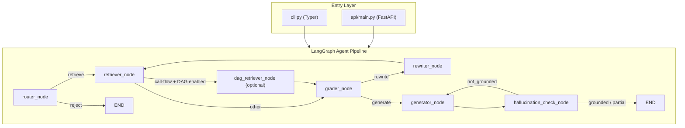

# SpecAgent — Developer Guide

## Architecture Overview

Four layers: **Entry** (CLI + FastAPI) → **Agent pipeline** (LangGraph StateGraph, 7 nodes) → **Retrieval** (LanceDB hybrid search + optional Kuzu DAG) → **Support** (LLM factory, observability, tracing, evaluation).



Directory tree and commands are in `CLAUDE.md`.

## Key Modules and Responsibilities

### `config.py` — Settings singleton

`Settings` inherits `pydantic_settings.BaseSettings`. All fields map to env vars (case-insensitive). Exposed as module-level `settings` via `@lru_cache`. Critical thresholds:

| Setting                         | Default | Purpose                                    |
| ------------------------------- | ------- | ------------------------------------------ |
| `grader_confidence_threshold`   | 0.60    | Below this → trigger rewrite               |
| `min_relevant_chunk_percentage` | 0.50    | Below this → trigger rewrite               |
| `high_similarity_threshold`     | 0.85    | Top-3 avg above → skip rewrite             |
| `max_rewrites`                  | 1       | Per-pipeline cap (overridable per request) |
| `retrieval_top_k`               | 10      | Chunks fetched per retrieval call          |

Full env var list: see [api-reference.md](api-reference.md#key-environment-variables).

### `graph/state.py` — Shared pipeline state

`GraphState` is `TypedDict(total=False)` — all fields optional for incremental population. Key field groups:

```
Input:          question
Routing:        route_decision, route_reasoning
Retrieval:      retrieved_chunks, rewritten_question
DAG retrieval:  dag_chunks
Grading:        graded_chunks, average_confidence
Rewriting:      rewrite_count
Generation:     generation, citations
Hallucination:  hallucination_check, ungrounded_claims, regeneration_count
Overrides:      max_rewrites_override, library_filter
Metadata:       error, processing_time_ms, node_timings, trace_id
```

### `graph/workflow.py` — Pipeline orchestration

`build_graph()` wraps each node with `create_timed_node()` (timing) and `create_traced_node()` (Phoenix OTel span). Conditional edges:

- `should_retrieve`: `router → retrieve | reject`
- `should_rewrite`: `grader → rewrite | generate` (high-similarity fast heuristic first)
- `should_regenerate`: `hallucination → regenerate | finish` (one regeneration allowed on `not_grounded`)

`run_query()` is the public entry point — creates initial state, invokes the compiled graph (process-level singleton), flushes `QueryJournal` and monitoring report.

### `nodes/` — Agent nodes

Every node: `def node_name(state: GraphState) -> GraphState`. Errors go to `state["error"]`, never raised.

| Node                       | LLM calls                        | Key output fields                          |
| -------------------------- | -------------------------------- | ------------------------------------------ |
| `router_node`              | 1 (`RouteDecision`)              | `route_decision`, `route_reasoning`        |
| `retriever_node`           | 0                                | `retrieved_chunks`, `retrieval_events`     |
| `dag_retriever_node`       | 0 (Kuzu; optional)               | `dag_chunks`                               |
| `grader_node`              | 0–1 (batched `BatchGradeResult`) | `graded_chunks`, `average_confidence`      |
| `rewriter_node`            | 1                                | `rewritten_question`, `rewrite_count`      |
| `generator_node`           | 1                                | `generation`, `citations`                  |
| `hallucination_check_node` | 0–1 (skipped above threshold)    | `hallucination_check`, `ungrounded_claims` |

Grader auto-grade: similarity > 0.82 → auto-yes; < 0.55 → auto-no; mid-range → single batched LLM call.
Hallucination skip: avg_confidence ≥ 0.65 (numerical/tabular) or ≥ 0.70 (other).

### `kuzu/` — Kuzu embedded graph store

Optional call-flow DAG layer. `KuzuConnection` opens/creates a Kuzu DB at `kuzu_db_path` and auto-applies DDL. `CallFlowDagStore` writes docx call-flow diagrams as `CallFlowDag → HAS_STEP → DagStep` and `→ HAS_PARTICIPANT → DagParticipant`. Retrieval uses Kuzu's `any(kw IN $keywords WHERE ...)` predicate for case-insensitive keyword matching.

`dag_retriever_node` is reached only when `ENABLE_DAG_RETRIEVAL=true` and the query contains call-flow keywords (procedure, sequence, call flow, UE/AMF/gNB). Results injected into `state["dag_chunks"]` as `RetrievedChunk` with `section="Call Flow Diagram"`.

### `retrieval/store.py` — LanceDB access

`Store` wraps `lancedb.Table` with lazy connection. `search()` performs `query_type="hybrid"` (BM25 + ANN vector) with optional `WHERE` clause filtering. Schema migration (`_migrate_table`) adds `file_type`, `last_modified`, `page` to pre-existing tables.

### `retrieval/ingestor.py` — 7-step ingestion pipeline

`ingest(source, library, ...)` steps: read bytes → dedup (SHA-256 hash) → convert to Markdown → post-process → chunk → embed → write (then delete old version). `ingest_folder()` runs concurrently under `asyncio.Semaphore(max_concurrency)` and rebuilds FTS index once at the end.

### `llm/factory.py` — LLM abstraction

`get_llm(temperature)` returns a cached `LLMProtocol`. Two backends:

- `_GroqAdapter`: wraps `langchain_openai.ChatOpenAI` at `https://api.groq.com/openai/v1`
- `CustomEndpointLLM`: direct `requests.post` to OpenAI-compatible endpoint with tenacity retry + `@traceable`

Both expose `invoke(prompt: str) -> str` and `get_last_call() -> LLMCallRecord | None`.

### `api/main.py` — FastAPI application

`create_app()` uses a `lifespan` handler to eagerly open LanceDB and load the embedding model. `POST /query` runs `run_query()` via `asyncio.to_thread`. Rejected queries → HTTP 422; pipeline errors → HTTP 500.

## Data Models

### ChunkRecord (LanceDB schema)

| Field           | Type                | Description                          |
| --------------- | ------------------- | ------------------------------------ |
| `id`            | str (UUID4)         | Chunk-level unique ID                |
| `doc_id`        | str (UUID4)         | Document-level grouping key          |
| `library`       | str                 | Library tag (e.g. `"3gpp-specs"`)    |
| `source`        | str                 | Absolute file path                   |
| `content_hash`  | str                 | SHA-256 hex of raw bytes (dedup key) |
| `title`         | str                 | First `#` heading or filename stem   |
| `content`       | str                 | Chunk text                           |
| `embedding`     | list[float32] × 768 | nomic-embed-text-v1.5 vector         |
| `chunk_index`   | int                 | Zero-based position in document      |
| `metadata`      | str (JSON)          | Includes `section_header`            |
| `file_type`     | str                 | Extension without dot                |
| `last_modified` | str (ISO 8601)      | File mtime                           |
| `page`          | int                 | Page number (0 = not applicable)     |

## Entry Points and Request Flow

### CLI query flow

```
specagent query "question"
  → run_query(question)
    → create_initial_state(question)
    → _get_compiled_graph().invoke(state)  [router→retriever→grader→generator→hallucination]
    → _flush_query_journal(state)
    → build_query_report(state)
  → console.print(generation + citations)
```

### API query flow

```
POST /query  →  asyncio.to_thread(run_query, request.question, ...)
             →  _calculate_confidence(result)
             →  QueryResponse(answer, citations, confidence, metadata)
```

### Ingestion flow

```
specagent index --docs-dir ./specs
  → asyncio.run(ingest_folder(folder, library, ...))
    for each file (up to max_concurrency concurrent):
      → ingest(source, library)
        1. read_bytes()
        2. sha256 dedup check
        3. convert() → Markdown
        4. postprocess()
        5. chunk_with_metadata() → list[(text, section_header)]
        6. embed_documents() → float32 array
        7. store.upsert_chunks(); store.delete_document(old_doc_id)
    → store.rebuild_fts_index()
```

## Extending SpecAgent

### Adding a new LangGraph node

1. Write a failing test in `tests/unit/test_mynode.py` first.
2. Create `src/specagent/nodes/mynode.py` with `def mynode(state: GraphState) -> GraphState`.
3. Export from `src/specagent/nodes/__init__.py`.
4. Register in `workflow.py`: `workflow.add_node("mynode", _wrap(mynode, "mynode"))`.
5. Add edges and any new `GraphState` fields in `state.py`.

### Adding a new LLM backend

Implement `invoke(prompt: str) -> str` and `get_last_call() -> LLMCallRecord | None`, then add a branch in `llm/factory.py::create_llm()` and extend the `LLMProvider` `Literal` in `config.py`.

### Adding a new file format

Add the extension to `SUPPORTED_EXTENSIONS` in `retrieval/converter.py` and handle conversion in `convert()`. Chunking, embedding, and storage are format-agnostic.

## Important Design Decisions

**`total=False` TypedDict.** All `GraphState` fields are optional — nodes populate incrementally without requiring prior nodes to fill every field.

**Grader caps at top-3 chunks.** Reduces LLM token cost while preserving enough signal for the rewrite decision. High-similarity shortcut skips the LLM grader entirely for quality queries.

**Hallucination check is content-adaptive.** Lower skip threshold for numerical/tabular answers (0.65 vs 0.70) because numeric claims are harder to hallucinate plausibly and more damaging when wrong.

**Write-then-delete replace semantics.** New chunks are written before old ones are deleted — a failed write never destroys the existing index entry.

**LRU-cached singletons.** `get_store()`, `get_embedder()`, `get_llm()` use `@lru_cache`. Tests call `clear_resource_cache()` to reset between cases.

**Asymmetric embedding prefixes.** `nomic-embed-text-v1.5` requires `"search_document: "` at ingest and `"search_query: "` at query time. Omitting or swapping degrades retrieval quality significantly.
