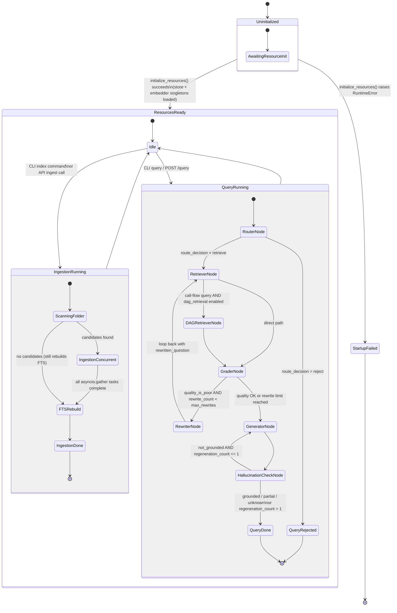

# End-to-End Pipeline State Machine

SpecAgent consists of two independent pipelines: the **Ingestion Pipeline** (offline, triggered by `specagent index`) that reads documents into LanceDB, and the **Query Pipeline** (online, triggered via API or CLI) that runs an agentic LangGraph RAG loop. This diagram shows how the two pipelines relate and the overall system lifecycle from cold start to steady-state operation.

