# Converter State Machine

The converter (`converter.py`) is a thin synchronous wrapper around the MarkItDown library. It validates file extensions, lazily initialises a module-level `MarkItDown` singleton under a `threading.Lock`, and returns the extracted Markdown text. For `.docx` files with OCR enabled, `convert_docx_ocr()` delegates to a separate `docx_ocr_converter` module. The state machine is linear for the happy path; errors map directly to domain exceptions.

```mermaid
stateDiagram-v2
    [*] --> Idle

    Idle --> CheckingExtension : convert(source) called

    CheckingExtension --> UnsupportedFormat : extension == "" (no extension)
    CheckingExtension --> UnsupportedFormat : extension not in SUPPORTED_EXTENSIONS
    CheckingExtension --> InitialisingMarkItDown : extension in SUPPORTED_EXTENSIONS (22 exts)

    UnsupportedFormat --> [*] : raises UnsupportedFormatError

    state InitialisingMarkItDown {
        [*] --> CheckSingleton
        CheckSingleton --> ReturnCached : _md is not None (fast path)
        CheckSingleton --> AcquireLock : _md is None
        AcquireLock --> DoubleCheckSingleton
        DoubleCheckSingleton --> ReturnCached : another thread initialised while waiting
        DoubleCheckSingleton --> InstantiatingMarkItDown : still None inside lock
        InstantiatingMarkItDown --> ReturnCached : MarkItDown() constructed, _md set
        ReturnCached --> [*]
    }

    InitialisingMarkItDown --> Converting : singleton ready

    Converting --> ConversionError : Exception raised by MarkItDown.convert()
    Converting --> EmptyResult : text_content is None or empty string
    Converting --> ConversionDone : text_content non-empty

    ConversionError --> [*] : raises IngestionError

    EmptyResult --> [*] : returns "" (warning logged; caller decides)

    ConversionDone --> [*] : returns Markdown string
```

