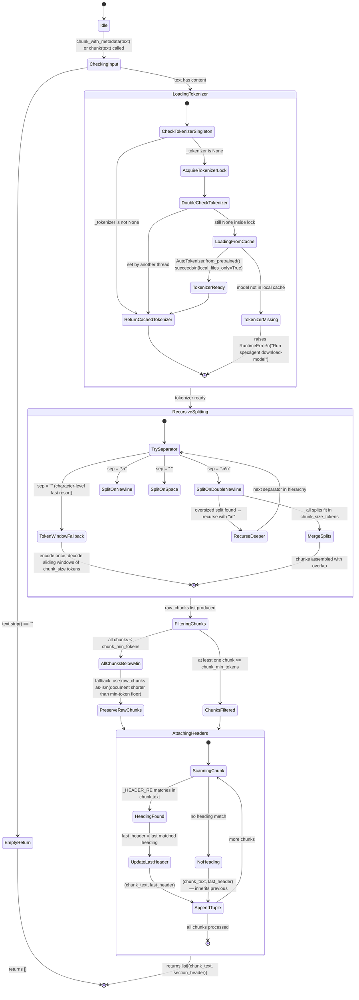

# Chunker State Machine

The chunker (`chunker.py`) splits Markdown text into token-bounded chunks using a recursive separator hierarchy (`\n\n`, `\n`, ` `, `""`). It uses a module-level tokenizer singleton (double-checked locking via `threading.Lock`) loaded from the local HuggingFace cache. `chunk_with_metadata()` wraps `chunk()` to attach the nearest Markdown heading to each chunk. The state machine is largely linear; the only branching is the tokenizer singleton initialisation and the post-filter fallback for very short documents.

