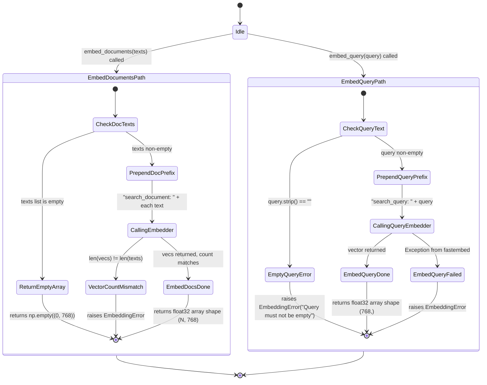

# Embedder State Machine

The embedder (`embedder.py`) prepends task-specific prefixes required by `nomic-embed-text-v1.5`'s asymmetric search design before calling the fastembed `TextEmbedding` model. `embed_documents()` is used at ingest time (prefix: `search_document: `); `embed_query()` is used at query time (prefix: `search_query: `). Both delegate to the `get_embedder()` singleton from `resources.py`. The state machine is trivially linear; the only branching is empty-input guards and error wrapping.

