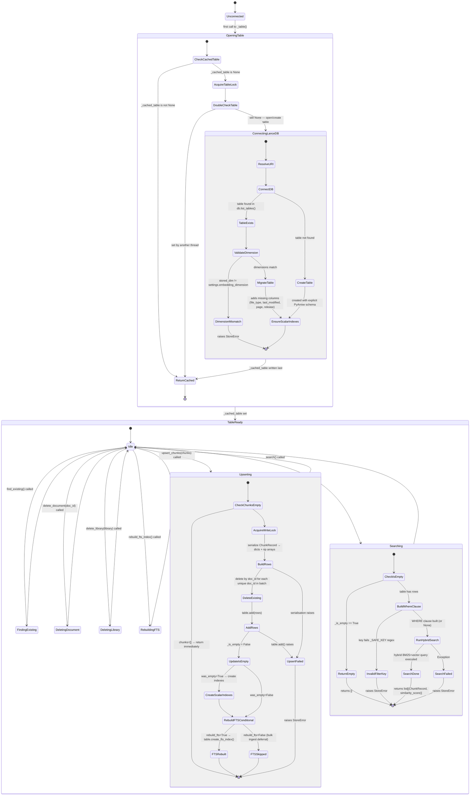

# LanceDB Store State Machine

The `Store` class (`store.py`) wraps LanceDB read/write operations. It uses double-checked locking on `_table_lock` for the one-time table open (open-or-create with schema validation and optional migration), and `_write_lock` to serialise concurrent `upsert_chunks()` calls from the `asyncio.to_thread` pool. The FTS index is rebuilt inside `upsert_chunks()` by default but can be deferred during bulk ingest. Search returns early if the table is empty (`_is_empty` flag).

