# Query Graph (LangGraph Workflow) State Machine

The query graph (`graph/workflow.py`) is a compiled LangGraph `StateGraph` that implements the agentic RAG loop. Every node follows the signature `node(state: GraphState) -> GraphState` and must never raise — errors are written to `state["error"]`. Nodes are wrapped in `create_timed_node` (accumulates ms in `state["node_timings"]`) and optionally `create_traced_node` (Phoenix OTel span). The rewrite loop is bounded by `max_rewrites` (default from settings, overridable per-request). The regeneration loop fires at most once.

```mermaid
stateDiagram-v2
    [*] --> RouterNode

    RouterNode --> Rejected : route_decision = "reject"
    RouterNode --> RetrieverNode : route_decision = "retrieve"\n(LLM error also defaults to retrieve)

    Rejected --> [*]

    state RetrieverNode {
        [*] --> EmbedQuery
        EmbedQuery --> EmbedFailed : Exception
        EmbedFailed --> RetrieverError : state["error"] set; retrieved_chunks = []
        EmbedQuery --> HybridSearch
        HybridSearch --> SearchFailed : Exception
        SearchFailed --> RetrieverError
        HybridSearch --> BuildChunks : results returned
        BuildChunks --> EmitRetrievalSpan : RetrievalRecord appended to retrieval_events
        EmitRetrievalSpan --> [*]
        RetrieverError --> [*]
    }

    RetrieverNode --> DAGRetrieverCheck : route_after_retriever() evaluated

    state DAGRetrieverCheck {
        [*] --> DAGEnabled
        DAGEnabled --> IsCallFlowQuery : settings.enable_dag_retrieval = True
        DAGEnabled --> BypassDAG : settings.enable_dag_retrieval = False
        IsCallFlowQuery --> DAGRetrieverNode : _KEYWORD_PATTERN matches question
        IsCallFlowQuery --> BypassDAG : no keyword match
        BypassDAG --> [*] : goes to GraderNode
        DAGRetrieverNode --> [*] : dag_chunks populated; graceful degradation on error
    }

    DAGRetrieverCheck --> GraderNode

    state GraderNode {
        [*] --> CheckChunksToGrade
        CheckChunksToGrade --> EmptyGrade : retrieved_chunks empty
        EmptyGrade --> [*] : graded_chunks=[]; average_confidence=0.0

        CheckChunksToGrade --> AutoGradeHigh : similarity > 0.82
        CheckChunksToGrade --> AutoGradeLow : similarity < 0.55
        CheckChunksToGrade --> LLMGradeRequired : 0.55 <= similarity <= 0.82

        AutoGradeHigh --> CollectGrades : relevant="yes", confidence=similarity_score
        AutoGradeLow --> CollectGrades : relevant="no", confidence=1-similarity_score
        LLMGradeRequired --> BatchLLMCall : all mid-range chunks sent in one LLM call
        BatchLLMCall --> CountMismatch : LLM returns wrong number of grades
        BatchLLMCall --> CollectGrades : grades inserted at original positions
        CountMismatch --> FallbackAutoGrade : midpoint auto-grade applied
        FallbackAutoGrade --> CollectGrades

        CollectGrades --> [*] : graded_chunks and average_confidence set
    }

    GraderNode --> RewriteDecision

    state RewriteDecision {
        [*] --> CheckHighSimilarity
        CheckHighSimilarity --> GeneratePath : avg_similarity(top-3) >= high_similarity_threshold
        CheckHighSimilarity --> CheckQualityMetrics : below threshold

        CheckQualityMetrics --> RewritePath : quality_is_poor AND rewrite_count < max_rewrites
        CheckQualityMetrics --> GeneratePath : quality OK or rewrite limit reached

        RewritePath --> [*] : goes to RewriterNode
        GeneratePath --> [*] : goes to GeneratorNode
    }

    RewriteDecision --> RewriterNode : "rewrite"
    RewriteDecision --> GeneratorNode : "generate"

    state RewriterNode {
        [*] --> CheckRewriteLimit
        CheckRewriteLimit --> ReturnUnchanged : rewrite_count >= max_rewrites
        CheckRewriteLimit --> BuildRewritePrompt : under limit

        BuildRewritePrompt --> LLMRewrite : prompt with original question + chunk summaries
        LLMRewrite --> RewriteError : Exception
        LLMRewrite --> UpdateRewrittenQuestion : rewritten_question set; rewrite_count++

        ReturnUnchanged --> [*]
        UpdateRewrittenQuestion --> [*]
        RewriteError --> [*] : state["error"] set; state unchanged otherwise
    }

    RewriterNode --> RetrieverNode : loop back (rewrite_count bounded by max_rewrites)

    state GeneratorNode {
        [*] --> FilterRelevantChunks
        FilterRelevantChunks --> NoContext : no relevant chunks AND no dag_chunks
        NoContext --> [*] : generation = "I don't have enough information..."

        FilterRelevantChunks --> BuildContext : relevant_chunks and/or dag_chunks available
        BuildContext --> LLMGenerate : context string assembled (temp=0.0)
        LLMGenerate --> GenerateError : Exception
        LLMGenerate --> ParseCitations : answer string returned

        ParseCitations --> [*] : citations extracted via CITATION_PATTERN regex
        GenerateError --> [*] : state["error"] set; generation=None; citations=[]
    }

    GeneratorNode --> HallucinationCheckNode

    state HallucinationCheckNode {
        [*] --> CheckGeneration
        CheckGeneration --> SkipCheck_Empty : generation is None or empty
        SkipCheck_Empty --> [*] : hallucination_check="grounded"

        CheckGeneration --> CheckConfidenceThreshold : generation present
        CheckConfidenceThreshold --> SkipCheck_HighConf : avg_confidence >= skip_threshold\n(0.65 numerical / 0.70 other)
        SkipCheck_HighConf --> [*] : hallucination_check="grounded" (skipped)

        CheckConfidenceThreshold --> RunLLMCheck : avg_confidence < threshold
        RunLLMCheck --> CheckFailed : Exception
        RunLLMCheck --> CheckDone : HallucinationResult parsed

        CheckFailed --> [*] : hallucination_check="unknown"; regeneration_count unchanged
        CheckDone --> [*] : hallucination_check = grounded/not_grounded/partial\nregeneration_count++ (only when check ran)
    }

    HallucinationCheckNode --> RegenerateDecision

    state RegenerateDecision {
        [*] --> CheckHallucinationResult
        CheckHallucinationResult --> RegeneratePath : not_grounded AND regeneration_count <= 1
        CheckHallucinationResult --> FinishPath : grounded / partial / unknown\nor regeneration_count > 1

        RegeneratePath --> [*] : goes to GeneratorNode (retry once)
        FinishPath --> [*] : goes to END
    }

    RegenerateDecision --> GeneratorNode : "regenerate"
    RegenerateDecision --> [*] : "finish"
```

