# API Server State Machine

The FastAPI application (`api/main.py`) manages two distinct lifecycles: the server startup/shutdown controlled by the `lifespan` async context manager, and the per-request query lifecycle on the `POST /query` endpoint. The `GET /health` endpoint is stateless and always returns immediately. Resource initialisation (LanceDB store, fastembed embedder) is eager at startup to prevent first-request latency spikes.

```mermaid
stateDiagram-v2
    [*] --> Starting

    state Starting {
        [*] --> InitialisingStore
        InitialisingStore --> StoreReady : get_store() succeeds
        InitialisingStore --> StartupFailed : get_store() raises RuntimeError

        StoreReady --> InitialisingEmbedder
        InitialisingEmbedder --> EmbedderReady : get_embedder() succeeds
        InitialisingEmbedder --> StartupFailed : get_embedder() raises RuntimeError

        EmbedderReady --> SetupTracing : settings.enable_tracing = True
        EmbedderReady --> SetupLangSmith : settings.enable_langsmith = True
        EmbedderReady --> Ready : tracing disabled

        SetupTracing --> Ready
        SetupLangSmith --> Ready
    }

    Starting --> Ready : lifespan startup completes
    Starting --> [*] : StartupFailed — raises RuntimeError; uvicorn exits

    state Ready {
        [*] --> AwaitingRequest

        AwaitingRequest --> HealthCheck : GET /health received
        AwaitingRequest --> QueryRequest : POST /query received

        state HealthCheck {
            [*] --> CheckStore
            CheckStore --> HealthyResponse : store is not None
            CheckStore --> HealthyResponse : Exception caught → index_loaded=False
            HealthyResponse --> [*] : 200 HealthResponse
        }

        state QueryRequest {
            [*] --> ValidateRequest
            ValidateRequest --> InvalidRequest : Pydantic validation fails
            InvalidRequest --> [*] : 422 Unprocessable Entity

            ValidateRequest --> RunPipeline : question valid

            RunPipeline --> PipelineRunning : asyncio.to_thread(run_query) dispatched

            state PipelineRunning {
                [*] --> GraphInvoke
                GraphInvoke --> PipelineDone : graph.invoke(state) returns
                GraphInvoke --> UnhandledError : unexpected Exception
            }

            PipelineRunning --> CheckRouteDecision : PipelineDone
            PipelineRunning --> InternalError : UnhandledError

            CheckRouteDecision --> OffTopicResponse : route_decision == "reject"
            CheckRouteDecision --> CheckPipelineError : route_decision == "retrieve"

            OffTopicResponse --> [*] : 422 {"error": "off_topic"}

            CheckPipelineError --> InternalError : state["error"] is set
            CheckPipelineError --> BuildResponse : no error in state

            BuildResponse --> [*] : 200 QueryResponse with answer, citations, metadata

            InternalError --> [*] : 500 {"error": "pipeline_error" or "internal_error"}
        }

        HealthCheck --> AwaitingRequest
        QueryRequest --> AwaitingRequest
    }

    Ready --> Shutdown : SIGTERM / process exit

    state Shutdown {
        [*] --> ReleasingResources
        ReleasingResources --> [*] : resources GC'd on process exit
    }

    Shutdown --> [*]
```

