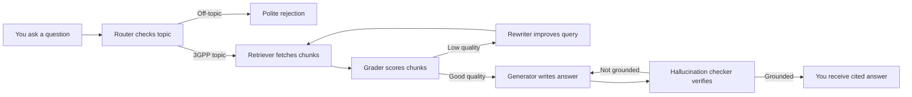

# SpecAgent — Overview

SpecAgent is an agentic question-answering system for 3GPP telecommunications specifications. Telecom engineers working with 5G NR, LTE, and related standards must regularly consult hundreds of dense specification documents to answer precise technical questions — a process that can take hours when done manually. SpecAgent lets engineers type a natural-language question and receive a direct, cited answer drawn exclusively from the indexed specification documents, with inline references pointing to the exact section of the relevant 3GPP spec.

Unlike simple keyword search or a basic RAG chatbot, SpecAgent employs an agent loop that automatically evaluates retrieval quality, rewrites the query when needed, verifies the generated answer is grounded in the source material, and retries generation once if a hallucination is detected — all before the answer is returned to the user.

## Key Benefits

- **Cited answers, not guesses.** Every factual claim in the answer includes an inline citation such as `[TS 38.321 §5.4.1]`, traceable back to the source spec section.
- **Agentic quality control.** The system grades its own retrieved chunks, rewrites the query if the results are poor, and checks the final answer for unsupported claims.
- **Works on your documents.** Index any combination of 3GPP specs in PDF, DOCX, HTML, TXT, or Markdown format. Documents are deduplicated by content hash, so re-running the index command is safe and incremental.
- **Two access modes.** Use the `specagent query` CLI for one-off lookups, or run `specagent serve` to expose a REST API that any application can call.
- **Targets 85%+ accuracy** on the TSpec-LLM benchmark — significantly above the 71–75% baseline of naive RAG.
- **Fast responses.** Designed to answer in under 3 seconds (P95) on standard hardware.

## How It Works



The agent routes each question through a six-node pipeline: the router filters off-topic questions, the retriever fetches the most relevant document chunks using hybrid BM25 and vector search, the grader scores their relevance, the rewriter improves low-quality queries and loops back to retrieval, the generator synthesizes a cited answer from the relevant chunks, and the hallucination checker verifies every claim is supported before the answer is returned.

## Main Use Cases

### Ask a precise 3GPP parameter question

**Input:** `specagent query "What is the maximum number of HARQ processes in NR?"`

**Output:**
```
Answer:
In NR, the maximum number of HARQ processes is 16 for both FDD and TDD operation.
[TS 38.321 §5.4.1]

Citations:
  • [TS 38.321 §5.4.1]
```

### Query via REST API

**Input (HTTP POST to `/query`):**
```json
{
  "question": "What is the RRC connection reconfiguration procedure for X2 handover?",
  "verbose": false
}
```

**Output:**
```json
{
  "answer": "The RRC connection reconfiguration procedure for X2 handover involves ... [TS 38.331 §5.3.3]",
  "citations": [{"spec_id": "TS38.331", "section": "5.3.3", "chunk_preview": "..."}],
  "confidence": 0.88,
  "metadata": {"rewrites": 0, "chunks_retrieved": 10, "chunks_used": 3, "latency_ms": 2100}
}
```

## Getting Started

1. Install SpecAgent: `pip install -e ".[dev]"`
2. Set your Groq API key: `export GROQ_API_KEY=your_key`
3. Download the embedding model: `specagent download-model`
4. Place your 3GPP spec files in `data/docs/` and index them: `specagent index`
5. Ask a question: `specagent query "What is the UE maximum transmission power in NR?"`

See [Installation](./installation.md) for full setup instructions and Docker Compose instructions.

## Important Limitations and Requirements

- **Scope is strictly 3GPP.** The router node rejects questions that are not related to telecommunications specifications. General-purpose questions (cooking, programming concepts unrelated to telecom, etc.) receive a rejection response.
- **Groq free-tier rate limits.** The default LLM backend (Groq, `llama-4-scout-17b-16e-instruct`) is subject to 30K tokens per minute and 500K tokens per day on the free tier. Heavy usage or concurrent queries may hit these limits. A custom OpenAI-compatible endpoint can be configured as an alternative.
- **Memory constraint.** The system is designed for a 4 GB RAM limit (Kubernetes pod default). The LanceDB index for approximately 500,000 vectors occupies roughly 1.5 GB.
- **Index must be built first.** SpecAgent cannot answer questions about documents that have not been ingested. Run `specagent index` after placing spec files in the configured directory.
- **Internet access required.** The Groq LLM backend requires outbound internet connectivity. The embedding model runs fully locally (ONNX via fastembed) after the one-time `download-model` step.
- **Hallucination check is probabilistic.** The hallucination checker uses an LLM judge and may not catch every unsupported claim. The `hallucination_status` field in the API response indicates the check result (`grounded`, `partial`, or `not_grounded`).
